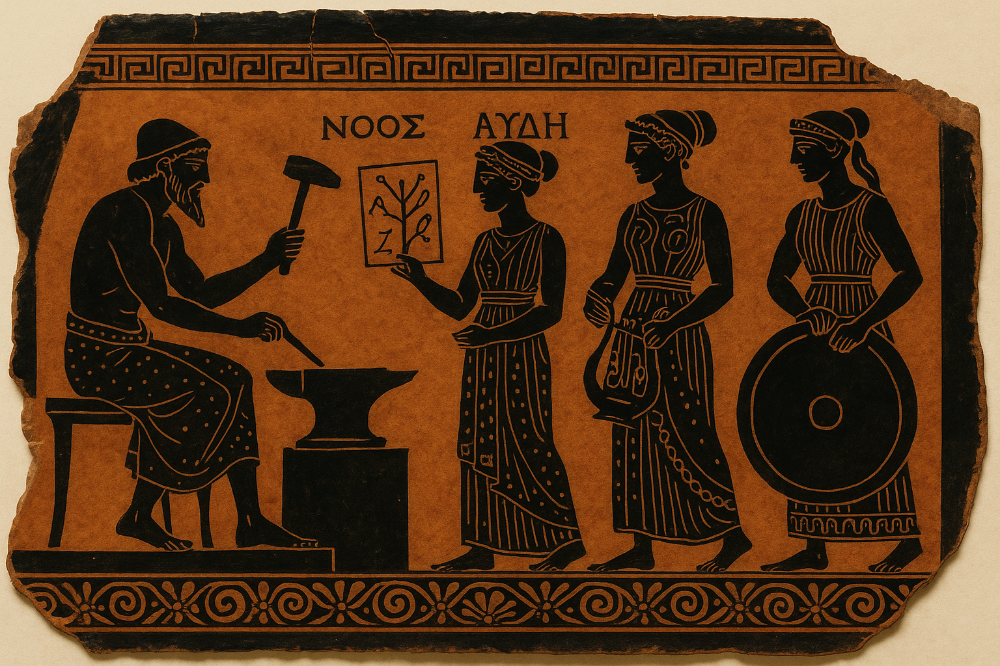

<figure>
  
  <figcaption>
    <strong>Figure 1</strong>: Hephaistos vibe-forging Achilles' armour with LLM-augmented <a href="/my-last-conversation-with-gpt5#postscript-the-meme-lives-on">ἀμφίπολοι</a>
  </figcaption>
</figure>
