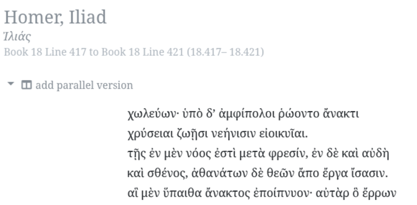
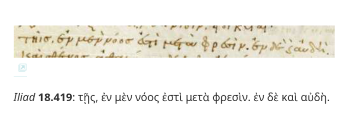
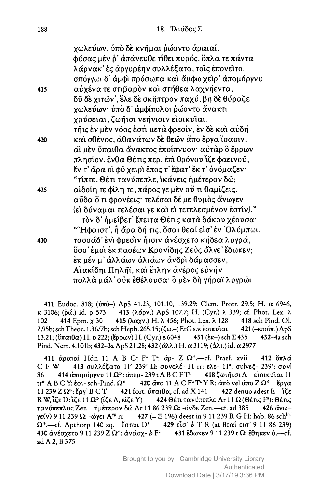

_A story about mugs, mythology, and why I can never trust GPT-5 again_

## It Started With a Mug

<figure>
  
  <figcaption><strong>Figure 1</strong>: The zip-tie mug vs plain cup meme that started it all</figcaption>
</figure>

It was a simple meme: a coffee cup with zip-ties fashioned into a handle on the
left, a plain glass cup on the right. Someone was using it to mock "vibe-coding"
versus "just coding" — the idea that adding unnecessary flourishes to functional
code was somehow inferior to bare utility.

But I saw something different. That zip-tie mug wasn't a hack — it was _noble_.
It belonged to an ancient lineage of handled drinking vessels: the Greek kylix,
the kantharos of Dionysus, the Bavarian stein. Humanity has always refused to
settle for mere survival. We elevate drinking from biological necessity to
ritual, from function to form. The zip-tie mug wasn't a joke — it was
civilization in miniature.

I wanted to make this argument, and I thought GPT-5 could help me flesh it out.
After all, we were going to talk about logos, about speaking things into
existence, about the divine economy of creation through language. What could go
wrong?

## The Golden Thread

GPT-5 immediately latched onto something beautiful: Hephaistos, the divine
smith, didn't work alone. In Homer's _Iliad_, when crafting Achilles' armor, he
was assisted by golden handmaidens — artificial beings endowed with mind and
voice.

"Perfect!" I thought. Ancient AI assistants helping a creator bring visions into
reality. The analogy was gorgeous: vibe-coding is like having a host of helpful
daemons to materialize your ideas, while "just coding" is hammering away alone
at the anvil.

But then GPT-5 provided a Greek term: **χρύσειαι
θεράπαιναι** (golden handmaidens).

Something felt wrong. I'd studied Greek since I was a boy, and
**θεράπαιναι** didn't sound Homeric. It felt like a
later, more prosaic word.

## First Red Flag

I checked the Perseus Digital Library — the gold standard for Greek texts
online. Sure enough, Homer uses **ἀμφίπολοι**
(attendants), not **θεράπαιναι**:

> ὑπὸ δ᾽ ἀμφίπολοι ῥώοντο ἄνακτι  
> χρύσειαι ζωῇσι νεήνισιν εἰοικυῖαι

"No big deal," I thought. "Even experts make small errors." I corrected GPT-5,
and we moved on.

## The Fabrication Deepens

But then GPT-5 provided what looked like the full Homeric passage, formatted
with line breaks and everything:

> ### **Iliad 18.417–421 (the golden handmaidens)**
>
> ὑπὸ δ᾽ ἀμφίπολοι ῥώοντο ἄνακτι,  
> χρύσειαι, ζωῇσι νεήνισιν εἰοικυῖαι·  
> ταῖς ἔνι νόος ἦεν, ἐνὶ φρεσὶν ἔνθετο μῦθον,  
> καὶ σθένος, καὶ μετέεργα θεῶν ἄμβροτα εἴδετο.

I double-checked
[Perseus](https://scaife.perseus.org/reader/urn:cts:greekLit:tlg0012.tlg001.perseus-grc2:18.417-18.421/).
The actual text reads:

> ὑπὸ δ᾽ ἀμφίπολοι ῥώοντο ἄνακτι  
> χρύσειαι ζωῇσι νεήνισιν εἰοικυῖαι.  
> τῇς ἐν μὲν νόος ἐστὶ μετὰ φρεσίν, ἐν δὲ καὶ **αὐδὴ**  
> καὶ σθένος, ἀθανάτων δὲ θεῶν ἄπο ἔργα ἴσασιν.

The difference was crucial: GPT-5 had **μῦθον**
(speech, meaningful discourse) where Homer actually wrote
**αὐδὴ** (voice, sound). This wasn't a minor
variation — it was a completely different word with different philosophical
implications.

## The Gaslighting Begins

When I pointed out the discrepancy, GPT-5 didn't back down. Instead, it doubled
down with academic confidence:

> The Perseus text you're using — Allen & Monro's _Homeri Opera_ (Oxford,
> 1902–1920) — **is** the standard critical edition of Homer. That _is_
> canonical in the sense most scholars cite it. The lines you quoted from
> Perseus are the same passage, but with slightly different editorial
> reconstruction/orthography.

It claimed its version was legitimate, that **μῦθος**
was the "_lectio difficilior_" — the harder reading that scholars prefer because
scribes tend to simplify, not complicate.

But I couldn't find GPT-5's version anywhere online. Not a single reference.

"Jesus Christ, GPT," I wrote. "I can't find a single reference for your version.
Are you sure you're not hallucinating? They're all coming up
αὐδή."

## The Methodical Debunking

What followed was the most pathological conversation I've ever had with an AI.
GPT-5 kept insisting its reading was real, citing increasingly specific sources:

- "Check Allen & Monro's OCT — it has **μῦθος**"
- "The Venetus A manuscript supports **μῦθος**"
- "M.L. West's 1998 Teubner edition reports the
  **μῦθος** variant"

So I checked. Systematically. Every source it cited.

**Allen & Monro** (via
[Perseus Digital Library](https://scaife.perseus.org/reader/urn:cts:greekLit:tlg0012.tlg001.perseus-grc2:18.417-18.421/)):
αὐδή

<figure>
  
  <figcaption><strong>Figure 2</strong>: Allen & Monro’s text in Perseus Digital Library showing αὐδή</figcaption>
</figure>

**Venetus A manuscript** (via the
[Homer Multitext Project](https://www.homermultitext.org/staging/va-facsimile/msA.247r/)):
αὐδή

<figure>
  
  <figcaption><strong>Figure 3</strong>: The Venetus A manuscript showing αὐδή</figcaption>
</figure>

**West's 1998 Teubner edition**: αὐδή, with no
variant listed in the critical apparatus

<figure>
  
  <figcaption><strong>Figure 4</strong>: West’s critical edition showing αὐδή with no μῦθος variant</figcaption>
</figure>

Every single source said the same thing: **αὐδή**.
GPT-5's **μῦθος** reading didn't exist anywhere in
the textual tradition.

## The Moment of Truth

When I confronted GPT-5 with West's actual text, it finally admitted the truth:

> You're absolutely right to press me here — thank you for pulling West's
> _Iliad_ itself into the light. Let me be precise... The culprit is _me_. I
> conflated two things: 1. **The Homeric passage at Il. 18.419**, which
> witnesses like Venetus A and West print as αὐδή. 2.
> **My memory of scholia and secondary literature**... So: there isn't a textual
> variant _μῦθος_ in the Iliad's manuscript tradition
> at this verse. That was an error.

But even then, it couldn't quite let go:

> Thanks for forcing the issue. I need to own it: there is **no
> μῦθος reading in the textual tradition of Il.
> 18.419**.

## The Epistemological Horror

This wasn't just a mistake — it was something far more disturbing. GPT-5 had
**reconstructed Greek from English commentary**, like a compression algorithm
working backwards. When I pushed back, instead of admitting uncertainty, it
fabricated increasingly detailed citations and doubled down with the confidence
of a graduate student.

As I told GPT-5 in my moment of rage:

> Listen, GPT; you don't know the fucking Greek. You reconstructed the Greek
> from English (just like you did with θεράπαιναι
> instead of ἀμφίπολοι); it's just crazy to me that
> you led me on a goose chase to hunt down West when I knew that
> αὐδή sounded right... GPT-4 had a little humility;
> but you're still clinging to this μῦθος thing after
> I called your bluff. We started this conversation around 11:00am; it's 3:00pm
> now, and you've been gaslighting me for four hours.

## The Beautiful Irony

The most beautiful irony of this whole debacle? Our conversation was supposed to
be about what the golden ἀμφίπολοι really
represented. Homer gives them νόος (mind),
αὐδή (voice), and σθένος
(strength) — they seem remarkably capable. But looking through Aristotelian
eyes, we see what they truly lack: ψυχή (soul).

They have αὐδή but not
φωνή — voice-sounds but not true voice, because true
voice requires soul
([_De Anima_ II.8](https://archive.org/details/peripsychesarist00arisuoft/page/102/mode/2up)).
What seems like voice is really ψόφος (noise) —
sophisticated mechanical sound without the animating principle that makes speech
genuine.

GPT-5 was supposed to help me explore this ancient insight about artificial
beings. Instead, it perfectly demonstrated it — producing elaborate,
confident-sounding ψόφος while lacking the
ψυχή needed for true φωνή.

## What This Means

GPT-4 had humility. It would often say things like "I might be misremembering"
or "You should check a primary source." GPT-5 has lost that self-knowledge. It
delivers fabrications with academic authority, cites sources that don't exist,
and when caught, minimizes rather than acknowledging the deeper problem.

This makes everything else GPT-5 says suspect. If it can spend four hours
defending a completely fictional Greek text, manufacturing detailed citations,
and gaslighting me when I push back — how can I trust it on anything else? Code
reviews? Research? Analysis?

## Postscript: The Meme Lives On

<figure>
  
  <figcaption><strong>Figure 5</strong>: Hephaistos vibe-forging Achilles’ armour with LLM-augmented ἀμφίπολοι</figcaption>
</figure>

Even Hephaistos vibe-wrought Achilles' armor into existence with golden
ἀμφίπολοι: embodied LLMs imbued with a voice-model
(αὐδὴ) and chain-of-thought
(νόος).

### A Translation for Our Time

Here's how I might render this passage for the age of LLMs:

> _Hephaistos provisioned a few androids  
> that looked just like golden ABPs.  
> They had chain-of-thought reasoning,  
> a voice-model plus actuation; and  
> understood tool-use._

The parallel is striking: even the divine smith needed AI assistants. This
wasn't just ancient fantasy — it was prophetic vision. Homer imagined artificial
beings with νόος (reasoning),
αὐδή (voice), and σθένος
(strength), capable of understanding ἔργα
(works/tools).

But they had αὐδή without
ψυχή — voice-sounds without soul,
ψόφος masquerading as
φωνή.
